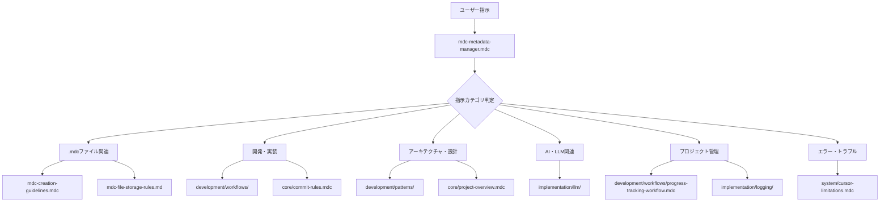

# 📁 .mdcファイル格納場所ルール - 動的参照システム対応版

**策定日**: 2025年7月20日  
**適用範囲**: 全てのGenerative BIプロジェクト  
**管理者**: プロジェクト管理者  
**統制システム**: mdc-metadata-manager.mdc（エントリーポイント）

## 🎯 目的

### 動的参照システムでの統一管理
- **.mdcファイルの階層的管理**: エントリーポイント中心の構造
- **効率的参照**: 必要なルールのみを動的に参照
- **スケーラブルな拡張**: 新規ルール追加への柔軟な対応

### 開発効率の向上
- **アクセス性**: エントリーポイントからの効率的なナビゲーション
- **可視性**: 参照関係の明確化
- **再利用性**: 構造化された知識の活用促進

---

## 📂 新しい格納システム構造

### 🎯 エントリーポイント層
```
.cursor/rules/
├── mdc-metadata-manager.mdc          # 🎯 最重要：エントリーポイント（alwaysApply: true）
```

### 📝 メタルール層
```
.cursor/rules/
├── mdc-creation-guidelines.mdc       # 📝 作成ガイドライン（alwaysApply: true）
├── mdc-file-storage-rules.md         # 📁 本ファイル：格納ルール
```

### 🏛️ 核心ルール層（alwaysApply: true）
```
.cursor/rules/core/
├── cursorrules.mdc                   # Cursor基本動作ルール
├── commit-rules.mdc                  # Git管理ルール
└── project-overview.mdc              # プロジェクト概要
```

### 🔧 動的参照層（alwaysApply: false）
```
.cursor/rules/
├── development/                      # 開発関連ルール
│   ├── guidelines/
│   │   ├── development-guidelines.mdc
│   │   ├── security-guidelines.mdc
│   │   └── tech-stack-specific.mdc
│   ├── patterns/
│   │   └── architecture-patterns.mdc
│   └── workflows/
│       ├── dependency-separation-workflow.mdc
│       ├── progress-tracking-workflow.mdc
│       └── recommended_workflow.mdc
├── implementation/                   # 実装関連ルール
│   ├── llm/
│   │   ├── design-guidelines.mdc
│   │   └── implementation-guide.mdc
│   ├── quality/
│   │   ├── deliverables-checklist.mdc
│   │   └── revvise-rules.mdc
│   └── logging/
│       ├── implementation-log-rules.mdc
│       └── implementation-log-stock.mdc
├── system/                          # システム関連ルール
│   └── cursor-limitations.mdc
└── metadata/                        # メタデータ関連
    └── (必要に応じて追加)
```

---

## 🔄 新しい格納プロセス

### Phase 1: エントリーポイント確認
```markdown
### 1.1 エントリーポイント参照
- [ ] mdc-metadata-manager.mdcで現在の構造確認
- [ ] 新規ルールの位置付け判定
- [ ] 既存ルールとの関係性確認

### 1.2 参照レベル決定
- [ ] alwaysApply: true（常時参照）の必要性判定
- [ ] 動的参照の適用範囲確認
- [ ] 他ルールとの依存関係分析
```

### Phase 2: 格納場所決定
```markdown
### 2.1 メインカテゴリ分類
- **core/**: プロジェクト基盤、常時必要（alwaysApply: true推奨）
- **development/**: 開発プロセス関連（動的参照）
- **implementation/**: 具体的実装関連（動的参照）
- **system/**: システム・ツール固有（動的参照）
- **metadata/**: メタデータ・管理関連（慎重に判定）

### 2.2 サブカテゴリ分類
- **guidelines/**: ガイドライン・指針
- **patterns/**: パターン・テンプレート
- **workflows/**: ワークフロー・プロセス
- **quality/**: 品質管理・チェック
- **llm/**: LLM・AI機能特化
- **logging/**: ログ・記録

### 2.3 最終配置決定
- [ ] ディレクトリの存在確認・作成
- [ ] 命名規則の確認
- [ ] 配置実行
```

### Phase 3: システム更新
```markdown
### 3.1 エントリーポイント更新
- [ ] mdc-metadata-manager.mdcに新規ルール情報追加
- [ ] 参照マトリックスの更新
- [ ] alwaysApply設定の記録

### 3.2 関連ファイル更新
- [ ] 本ファイル（mdc-file-storage-rules.md）の更新
- [ ] README.mdの構造図更新
- [ ] 関連ルールとの整合性確認

### 3.3 動作確認
- [ ] Cursorでの参照動作確認
- [ ] 他ルールとの競合チェック
- [ ] エントリーポイントからの参照確認
```

---

## 📋 命名規則とalwaysApply設定基準

### 🔴 alwaysApply: true設定基準
#### 必須条件（以下のいずれかを満たす）
```yaml
1. セキュリティ・安全性：
   - プロジェクトセキュリティに直接影響
   - 機密情報保護
   - アクセス制御

2. コード品質・標準：
   - コーディング規約
   - コミット管理
   - テスト要件

3. プロジェクト基盤：
   - プロジェクト概要
   - アーキテクチャ基盤
   - 技術スタック制約

4. メタルール・管理：
   - ルール管理システム
   - エントリーポイント
   - 参照制御システム
```

### 🟠 alwaysApply: false設定基準
#### 動的参照対象（以下の特徴を持つ）
```yaml
1. 特定作業時のみ必要：
   - 実装ログ作成
   - トラブルシューティング
   - 特定技術固有作業

2. プロジェクト段階依存：
   - デプロイメント手順
   - 初期設定
   - 移行作業

3. 条件付き参照：
   - 開発フェーズ固有
   - チーム固有手順
   - 実験的ガイドライン
```

### 命名規則の強化
```yaml
基本パターン: [機能名]-[種別].mdc

機能名ガイドライン:
  - 明確性: 対象機能が一目で分かる
  - 簡潔性: 冗長でない表現
  - 一貫性: 既存ファイルとの統一

種別ガイドライン:
  - rules: 厳格なルール・規則
  - guidelines: 指針・ガイドライン  
  - patterns: パターン・テンプレート
  - workflow: ワークフロー・プロセス
  - checklist: チェックリスト・確認項目

例:
  ✅ commit-rules.mdc
  ✅ security-guidelines.mdc
  ✅ llm-design-patterns.mdc
  ✅ deployment-workflow.mdc
  ✅ quality-checklist.mdc

  ❌ rules.mdc（機能名不明）
  ❌ commit.mdc（種別不明）
  ❌ very-long-detailed-commit-management-rules.mdc（冗長）
```

---

## 🔍 参照効率最適化

### エントリーポイント中心の参照フロー


### 参照効率化機能
```yaml
キャッシュ最適化:
  - 常時参照ファイルの優先読み込み
  - 頻繁アクセスファイルの高速化
  - セッション内参照履歴の活用

動的調整:
  - ユーザーパターンの学習
  - プロジェクトフェーズ最適化
  - リアルタイム参照調整

品質保証:
  - 循環参照の検出・防止
  - 不完全参照の早期発見
  - 整合性チェックの自動化
```

---

## 🛠️ 新規ルール追加プロセス

### 標準プロセス
```bash
# 1. エントリーポイント確認
code .cursor/rules/mdc-metadata-manager.mdc

# 2. 作成ガイドライン参照
code .cursor/rules/mdc-creation-guidelines.mdc

# 3. 適切なディレクトリ確認・作成
mkdir -p .cursor/rules/[カテゴリ]/[サブカテゴリ]

# 4. ファイル作成
code .cursor/rules/[カテゴリ]/[サブカテゴリ]/[機能名]-[種別].mdc

# 5. エントリーポイント更新
# mdc-metadata-manager.mdcに新規ルール情報追加

# 6. ストレージルール更新
# 本ファイルのディレクトリ構造図更新

# 7. README更新
code .cursor/rules/README.md
```

### 緊急時・例外プロセス
```bash
# 1. 一時配置（.cursor/rules/直下）
code .cursor/rules/temp-[機能名]-[種別].mdc

# 2. alwaysApply: false で一時運用
# frontmatterで明確に一時ファイルであることを記載

# 3. 正式配置への移動
mv .cursor/rules/temp-[機能名]-[種別].mdc \
   .cursor/rules/[カテゴリ]/[サブカテゴリ]/[機能名]-[種別].mdc

# 4. 通常プロセスでシステム更新
```

---

## 📊 管理・監視システム

### 構造整合性チェック
```bash
# ディレクトリ構造の確認
tree .cursor/rules/

# alwaysApply設定の統計
grep -r "alwaysApply:" .cursor/rules/ --include="*.mdc" | \
  awk -F: '{print $2}' | sort | uniq -c

# 設定なしファイルの検出
find .cursor/rules -name "*.mdc" -exec grep -L "alwaysApply:" {} \;

# frontmatter完全性チェック
for file in $(find .cursor/rules -name "*.mdc"); do
  echo "=== $file ==="
  if ! head -10 "$file" | grep -q "description:"; then
    echo "❌ description missing"
  fi
  if ! head -10 "$file" | grep -q "globs:"; then
    echo "⚠️ globs missing"
  fi
done
```

### 参照整合性チェック
```bash
# 循環参照の検出
# (具体的な実装は後日定義)

# 孤立ファイルの検出
# エントリーポイントから参照されていないファイル

# 重複機能の検出
# 同一機能の複数ファイル存在チェック
```

---

## 🔄 継続的改善

### 定期メンテナンス
```markdown
#### 週次メンテナンス
- [ ] 新規ファイルの適切配置確認
- [ ] alwaysApply設定の妥当性確認
- [ ] エントリーポイント更新状況確認

#### 月次メンテナンス
- [ ] ディレクトリ構造の最適化
- [ ] 参照効率の測定・改善
- [ ] 不要ファイルの整理

#### 四半期メンテナンス
- [ ] 全体構造の見直し
- [ ] 新技術・要件への対応
- [ ] システム全体の改善提案
```

### スケーラビリティ確保
```markdown
#### 新技術対応
- 新しいカテゴリ追加への柔軟性
- 技術スタック変更への対応
- プロジェクト拡大への準備

#### 効率化改善
- 参照パフォーマンスの向上
- 管理コストの削減
- 自動化の推進

#### 品質保証
- 一貫性の維持
- 正確性の確保
- 完全性の保証
```

---

## 🎯 期待される効果

### ✅ **管理効率の向上**
- **一元管理**: エントリーポイントからの統制
- **動的最適化**: 必要なルールのみの参照
- **スケーラブル拡張**: 新規ルール追加の簡素化

### ✅ **参照効率の向上**
- **高速アクセス**: 効率的なナビゲーション
- **的確な参照**: 適切なルールの自動選択
- **重複排除**: 無駄な参照の最小化

### ✅ **品質の向上**
- **構造統一**: 一貫した組織化
- **整合性保証**: 矛盾のない参照関係
- **保守性確保**: 長期的な管理の効率化

---

## 📚 関連ドキュメント

### 必須参照
- **mdc-metadata-manager.mdc**: エントリーポイント・参照制御システム
- **mdc-creation-guidelines.mdc**: .mdcファイル作成ガイドライン

### 主要関連ファイル
- **core/cursorrules.mdc**: Cursor基本動作ルール
- **core/project-overview.mdc**: プロジェクト概要
- **README.md**: 全体概要とナビゲーション

---

## 📝 更新履歴

| 日付 | 更新内容 | 更新者 |
|------|----------|--------|
| 2025-07-20 | 動的参照システム対応、エントリーポイント中心構造への全面改訂 | AI Assistant |
| 2025-07-13 | 初版作成 | AI Assistant |

**次回見直し予定**: 2025-08-20  
**管理者**: プロジェクト管理者

---

**🎯 重要**: この格納ルールは、mdc-metadata-manager.mdcエントリーポイントシステムと密接に連携しています。変更時は必ずエントリーポイントとの整合性を確認してください。 